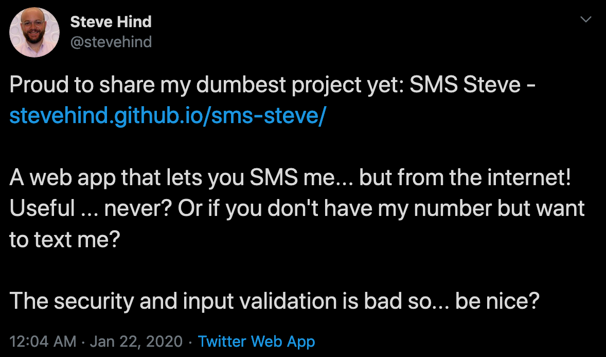

I recently came across a neat web app from [Steve Hind in my Twitter timeline](https://twitter.com/stevehind/status/1219848287613669377?s=20).
The app allows someone to fill out a short web form and send an SMS message to Steve.
I looked through the code to learn that the app consists of a React
[frontend](https://github.com/stevehind/sms-steve) and a [backend
server](https://github.com/stevehind/sms-steve-server)
implemented using Flask and deployed to Heroku.

<!--p align="c">
  <a href="https://twitter.com/stevehind/status/1219848287613669377?s=20">
    
  </a>
</p-->

I liked this app and I wondered if I could quickly eliminate the
server on the backend, because someone is paying the utility bill for
the server even if no one is sending Steve messages. Plus writing
server logic on the backend is invariably more code to write than just the
business logic someone like Steve really cares about. I also thought
that while this app is logically composed of a frontend and a backend,
there's no reason to separate the implementation of the two parts into
two different repositories in this case. So I forked Steve's repos and
wanted to make it easier for others to deploy the SMS app with a
repeatable cloud deployment.

**The cloud is complicated, but building great web apps that run in the
cloud does not have to be. This is among our goals at
[Nimbella](https://nimbella.com) and so I adapted Steve's SMS app for the
Nimbella cloud.**

I made the following minimal changes to the original code:
- Copied the essential functions from Steve's [backend implementation](https://github.com/stevehind/sms-steve-server) to [this repository](./packages/default/web-sms).
- Changed the [API url](https://github.com/rabbah/sms-steve/blob/b3a8c9d3689b2eef98c84c42c2446ead2b06ce2e/src/api.js#L3) to point to the Nimbella based implementation in this project. The frontend and backend are deployed to the same Nimbella cloud project. Nimbella takes care of automatically separating static assets for a CDN and routing API calls to the backend logic.
- Made the [frontend more generic](https://github.com/rabbah/sms-steve/commit/f748db79401bdd2b2dec3acf422ba9d6bad17b1f) so others who aren't named Steve can use this.

### How to deploy your own SMS web app

You can deploy your own version of this app to the Nimbella cloud.
These steps should work for Linux and Mac users (I haven't adapted the app for Windows development).

Prerequisites:
- [Access to the Nimbella cloud](https://nimbella-apigcp.nimbella.io). Install the Nimbella CLI called `nim` before you get started.
  _NOTE: newly provisioned accounts are limited access at the moment but will be opened more widely soon. If you happen to read these steps before then you <a href="mailto:rr@nimbella.com">can contact me and I'll unlock your account for full access</a>._
- [Twilio account](https://twilio.com) to send SMS messages.
- `npm` for building the React frontend.
- `python` v3.7 because Steve's implementation for the backend is in Python.

#### The environment file

You need to define the following environment properties before you can use the app. It is best to store these in a `.env` file inside the project.
There is a [`.env-template`](.env-template) file that you can use to generate your own `.env` file.
If you don't know where to find the Twilio details noted below, take a look at this [screenshot](docs/twilio-dash.png).

- `REACT_APP_MY_NAME`: this is your name (e.g., Steve)
- `REACT_APP_ABOUT_ME`: this is a link to you web page (e.g., http://www.stevehind.me/)
- `TO_NUMBER`: this is the number where you will receive the SMS messages
- `FROM_NUMBER`: this is your Twilio number
- `ACCOUNT_SID`: this is your Twilio account id
- `AUTH_TOKEN`: this is your Twilio account API token

#### Deploy to the Nimbella cloud

```bash
git clone https://github.com/rabbah/sms-steve.git
```
Now add your `.env` file to the project directory and then execute the following command.
```
nim project deploy sms-steve
```

The output of the deployment will look like this:
```
Deploying project '/path/to/sms-steve'
  to namespace '<your namespace>'
  on host 'https://apigcp.nimbella.io'
Started running ./build.sh in web
Started running ./build.sh in packages/default/web-sms
Finished running ./build.sh in packages/default/web-sms
Finished running ./build.sh in web

Deployed 18 web content items to
  https://<your namespace>-apigcp.nimbella.io
Deployed actions:
  - web-sms
```

Open the URL shown for your namespace and enjoy.
Here is mine https://smsdemo-apigcp.nimbella.io.

### More to come

I will enhance this app further so there's a public API endpoint to
see all messages sent through the app. This will showcase Nimbella's
integrated data services. With the Nimbella cloud, you never run a
server or provision a datastore. Because you should just build cool
apps, like [Steve](http://www.stevehind.me/), and not worry about the rest.
